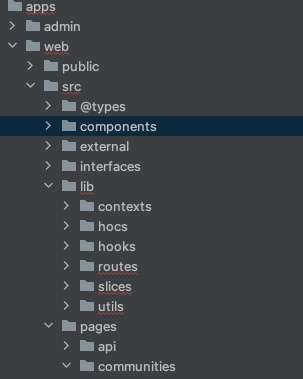
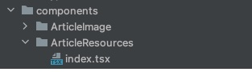

# When
- `2022. 10. 29. 20:00`
# Needs
42polar 모바일과 pc 프론트 코드를 컴포넌트화해서 리펙토링하려고 합니다
디자인에서 프론트 컴포넌트를 염두해두고 하는 개발 방법론 여쭙고 싶습니다
프론트 코드 작성시 컴포넌트를 어떻게 작성하고 사용하는 지(폴더구조, 클래스 등등)을 여쭙고 싶습니다

# Participants
- jokang 
- seoyepar (박서연)
- jiyokim (김지윤)

# Overview
프론트 작업에서 어떤 형태의 디자인 패턴이 있고, 어떤 장단점이 있는지 확인해보겠습니다.

자세한 내용에 앞서서, react 는 '상속'보다는 '구성'을 선호한다는 것을 얘기드립니다.

https://reactjs-kr.firebaseapp.com/docs/composition-vs-inheritance.html

우선 React 에서 자주 사용되느  design pattern 으로는
1. HOC (Higher Order Components)
<pre class="language-js" tabindex="0"><code class="language-js">import React, { Component } from "react";
const higherOrderComponent = (DecoratedComponent) =&gt; {
  class HOC extends Component {
    render() {
      return &lt;DecoratedComponent /&gt;;
    }
  }
  return HOC;
};</code></pre>

- 어떤 컴퍼넌트에 대해서 부수적인 작업들이 필요할 때 사용합니다.
  - 공지사항 페이지는 인증을 체크할 필요가 없고, 프로필 페이지에서는 인증을 체크할 필요가 있을 떄, 활용할 수 있겠죠.
  - 해당 버튼 클릭시에는 로깅을 전송함

2. hook
- hook은 16.8 부터 도입된 react 의 기능인데요. 해당 기능을 이용하면, react component 의 lifecycle 등을 잘 컨트롤 해서, rerendering 등을 방지할 수 있습니다. https://ko.reactjs.org/docs/hooks-rules.html 훅을 사용할 때 지켜야하는 규칙을 꼭 숙지하고 사용해야합니다.
- react component 의 mount 가 해제 되는 시점에, useEffect 상에서 수행한 로직에 대해, clean-up 해야할 코드들이 있다면, `return ()=>{ }` 을 수행하여 clean up 해주어야합니다.
- 보다 자세한 내용은 다음을 참고하면 좋겠습니다. https://ko.reactjs.org/docs/hooks-effect.html#example-using-hooks-1

# 예
| 전체 구조 | 컴퍼넌트들 |
| -- | -- |
|  |  |

# 운영 ( 버그 해결, 기능이 안된다, 기능 추가 )
- github issue 를 등록하고 해당 issue 로 PR 을 올리고 review 를 하는 형태로 운영하면 좋을 것 같아요. 누가 하는지에 대해서는 issue 의 내용을 읽어보고, assignee 를 선택하는 형태가 좋겠습니다.
- issue 등록시, slack 으로 notifiy 도 주면 참 좋겠네요.

# Admin
- admin 기능과는 별개로 누가 어떤 작업을 했는지에 대한 ( api 요청시 request-by, updatedAt ) 등과 같은 값을 남겨주면 좋습니다. ( 추후 문제가 생길 경우 )

# 끝으로
- 우선 이렇게 해라 라는 의미로 제가 멘토링을 마무리하지 않겠습니다. 디렉토리를 정리하시거나, 클래스를 정리하실 때는 팀내 규정을 따라가기 때문입니다. 보다 나은 방향을 찾게 된다면, 그것이 여러분들의 답입니다. 
- [NX](https://nx.dev/react-tutorial/2-project-graph_)